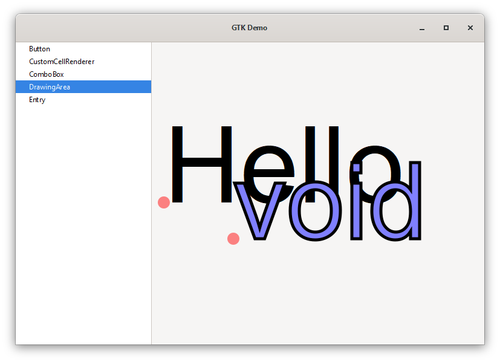

# GTK-RS Demo

This demo shows how I(personal use case) use to organize view and controller data in a gtk-rs program. Also, this example shows a lot of stuff about styling widgets, use drag and drop and how to use widgets references.

* **What do you need to start?**

You will need the gnu toolchain of rust for windows, because we can use **Msys2**, whats makes easier to maintain libraries available to compiler, than the **microsoft toolchain**. Using **Msys2** we have access to **pacman** tooling.

* **Installing Rust GNU toolchain** - On rustup tool, just change the first option from stable-x86_64-pc-windows-msvc to **stable-x86_64-pc-windows-gnu**(remember to choose the correct architecture for you pc).

* **Installing Msys2** - Download [Msys2](https://www.msys2.org/) and just do a default install.

* **Installing mingw gcc compiler** - In msys2 bash shell, just type the command below:
```
$ pacman -S mingw-w64-x86_64-toolchain 
```

* **Installing gtk3** - In msys2 bash shell, just type the command below:
```
$ pacman -S mingw-w64-x86_64-gtk3    
```

* **Installing glade** - In msys2 bash shell, just type the command below:
```
$ pacman -S mingw-w64-x86_64-glade    
```

* **Build and run the Demo** - You will need to build using msys2 shell or put mingw-gcc on path.
```
$ cargo run
``` 

